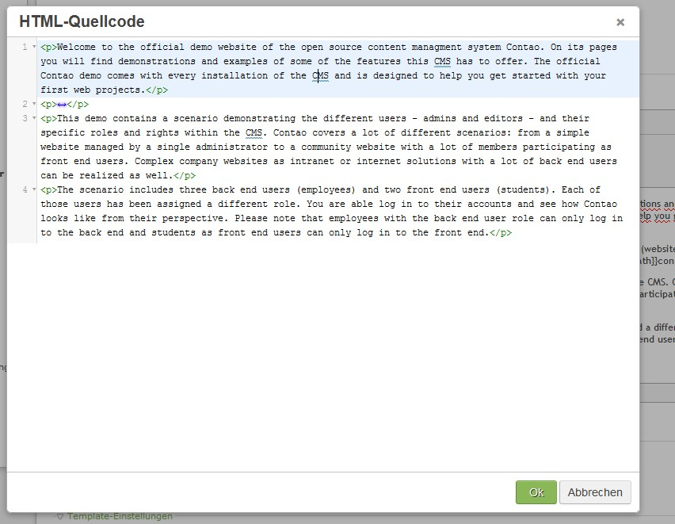

Contao Extension: TinyMceCodeMirror
====================================

Special TinyMCE plugin that integrates the excellent CodeMirror code editor, developed by Marijn Haverbeke, as HTML source editor.

The sources of this plugin could be found [here](http://www.avoid.org/codemirror-for-tinymce4/).

Installation
------------

Install the extension via composer: [cliffparnitzky/tiny-mce-code-mirror](https://packagist.org/packages/cliffparnitzky/tiny-mce-code-mirror).

If you prefer to install it manually, download the latest release here: https://github.com/cliffparnitzky/TinyMceCodeMirror/releases

Tracker
-------

https://github.com/cliffparnitzky/TinyMceCodeMirror/issues

Compatibility
-------------

- min. Contao version: >= 3.3.0
- max. Contao version: <  3.5.0

Dependency
----------

- To load this plugin and add it to the configuration the extension [[TinyMcePluginLoader]](https://github.com/cliffparnitzky/TinyMcePluginLoader) has to be installed.

Screenshot
----------

